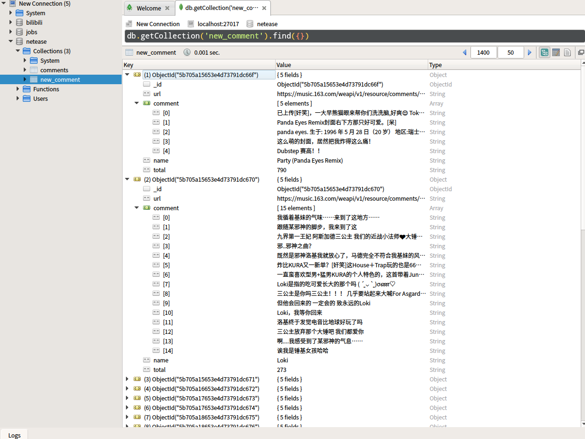
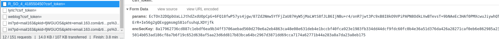
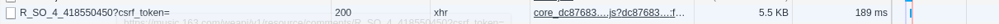
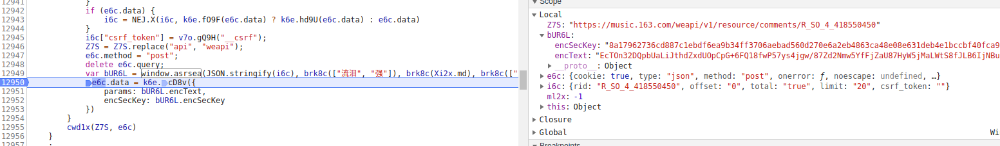
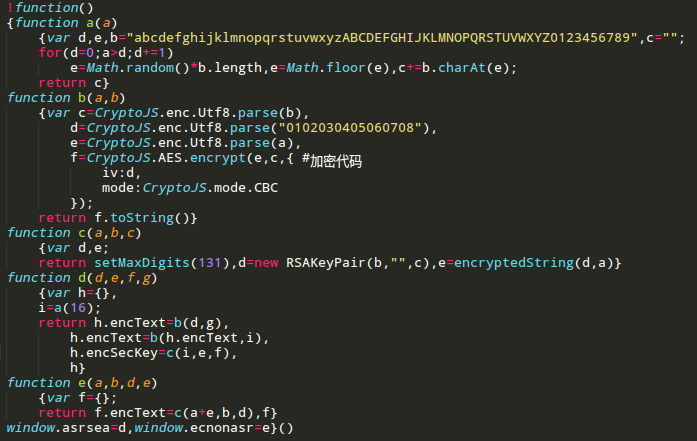
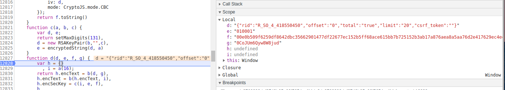

<h2>对网易云音乐热门评论进行爬取。</h2>

通过对网易云音乐的评论抓取，再由其页面的包含这首歌的歌单做爬取,不断取得新的歌曲评论

如果还想扩展爬取队列，可已再对喜欢这个歌单的用户进行爬取，每个人收藏的歌单超多

最后的存储结果为:

<h2>加密参数解析</h2> 

任选一首歌，分析得到，评论的加载源于URL：R_SO_4_id?csrf_token。其中Form Data的params和encSecKey为加密后的，如图
 
对这两个参数的分析，找到生成他们的js，如下图
 

在js中可找到 parmas 和encSeckey 生成函数:
 

由图可知生成的 Form Data 即为图1中的参数。观察可知函数是由bUR6L生成，对其进行定位，找到其生成为:
 

var bUR6L=window.asrsea(JSON.stringify(i6c),brk8c(["流泪","强"]),brk8c(Xi2x.md),brk8c(["爱心","女孩","惊恐","大笑"]))
 

再追踪 window.asrsea 可以得到函数
 

其中function a为生成随机的长度的字符串；b为AES加密，偏移量：0102030405060708，加密模式为CBC;c为RSA加密, 公匙为(第三个参数,第二个参数)

分析其可得：params和enSecKey最终由function d生成，此时设置断点，捕捉传入 function d 的四个参数
 

第一个参数为将json转化为字符串，第二三四由brk8c生成。多观察几个歌曲，可知，这三个参数是不变的，第一个参数随歌曲id变化。
 

因此，可得到四个参数，并得到其加密方法，编写程序
 

文献参考:<a href="https://www.zhihu.com/question/36081767">知乎</a>，感谢
 

本文档只做学习交流只用
